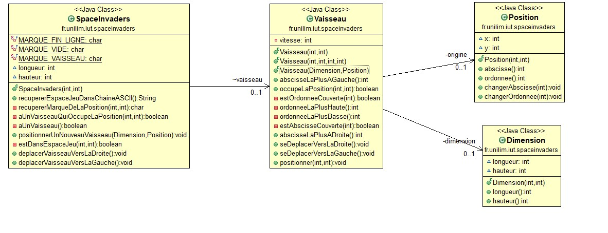
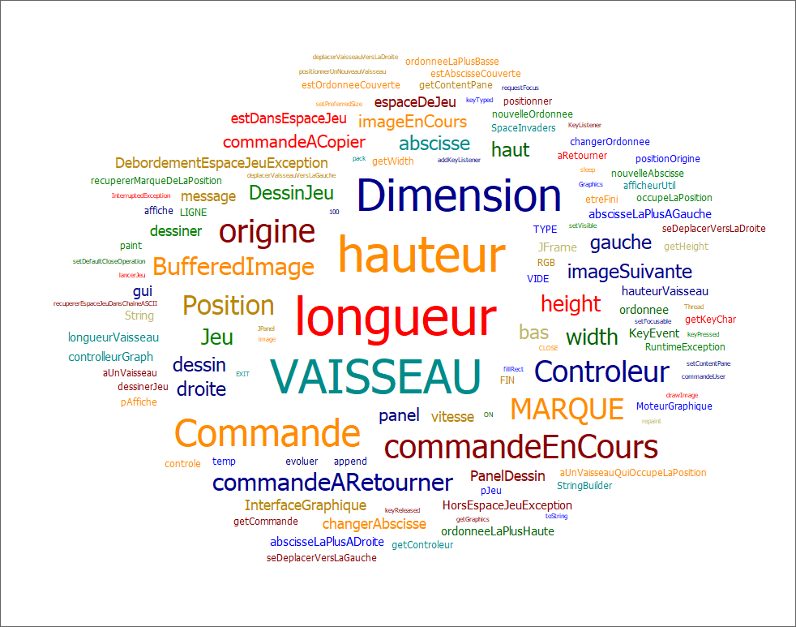
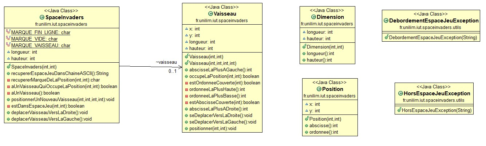
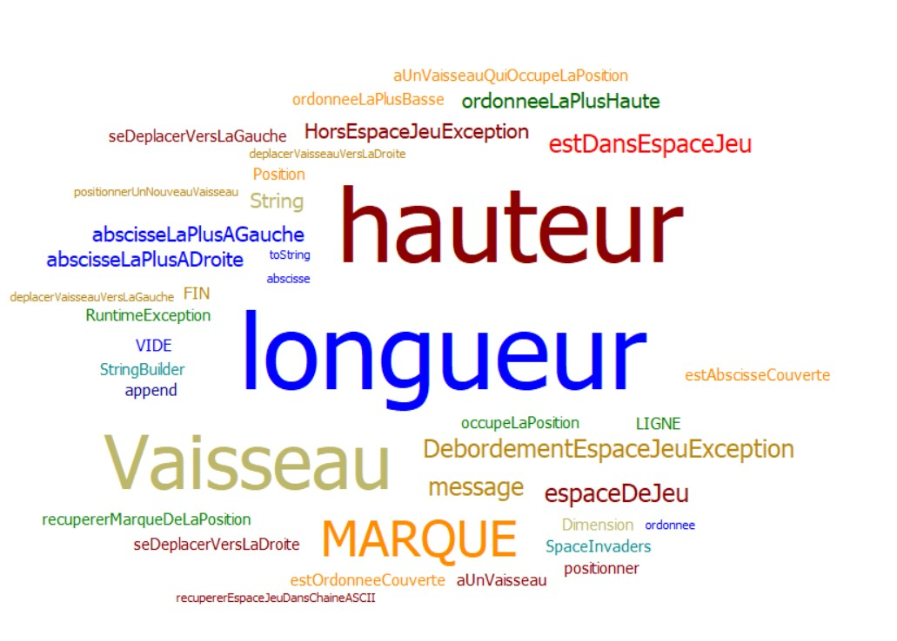
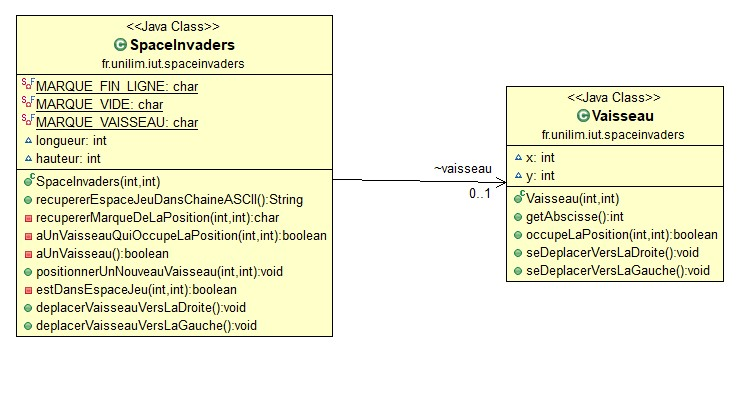

# spaceinvaders

- [Semaine n°3](#semaine3)
- [Semaine n°2](#semaine2)  
- [Semaine n°1](#semaine1)  
- [Glossaire](#glossaire)

## Semaine n°3 : 

Reprendre les rubriques de la semaine précédente et les compléter avec le travail réalisé cette semaine

### Sprints et fonctionnalités réalisées 

#### Fonctionnalité n°2 : Dimensionner le vaiseau

- Story n°4 : Déplacer un vaisseau vers la gauche en tenant compte de sa dimension
Le vaisseau se déplace d'un pas vers la gauche, si le vaisseau se trouve sur la bordure gauche de l'espace de jeu, le vaisseau reste immobile (aucun déplacement, aucune exception levée : le vaisseau reste à sa place)

- Story n°5 : Refactorer la classe Vaisseau
Refactorisation de la classe Vaisseau

#### Spike : Prise en main et intégration d'un moteur graphique

- Story n°1 : Récupérer l'API du moteur graphique dans un projet test 
Récupérer le moteur graphique et faire un test de celui-ci

- Story n°2 : Prendre connaissance du code et comprendre le fonctionnement du moteur graphique
Lire le document explicatif du code pour pouvoir l'implémenter dans notre programme

### Fonctionnalité en cours d'implémentation 
Space Invaders - Spike : Prise en main et intégration d'un moteur graphique

### Diagramme de classes 

### Nuage de mots 

 

### Difficultés rencontrées 
Aucune

-------------

## Semaine n°2 : 

### Sprints et fonctionnalités réalisées 

#### Fonctionnalités n°2 : Dimensionner le vaisseau

- Story n°1 : Positionner un nouveau vaisseau avec une dimension donné
Un nouveau vaisseau est créé avec des dimensions c'est -à-dire une hauteur et une largeur. Le vaisseau est toujours positionné de la même manière.

- Story n°2 : Faire en sorte qu'il soit impossible de positionner un nouveau vaisseau qui déborde de l'espace de jeu
Si le nouveau vaisseau essaye d'être positionner en dehors des limites de l'espace de jeu une exception est levée.

- Story n°3 : Déplacer un vaisseau vers la droite en tenant compte de sa dimension
Le vaisseau se déplace d'un pas vers la droite, si le vaisseau se trouve sur la bordure droite de l'espace de jeu, le vaisseau reste immobile (aucun déplacement, aucune exception levée : le vaisseau reste à sa place)

### Fonctionnalité en cours d'implémentation 
Déplacement vers la gauche en tenant compte de sa dimension

### Diagramme de classes 

### Nuage de mots 

 

### Difficultés rencontrées 
Aucune

-------------

## Semaine n°1 : 

### Sprints et fonctionnalités réalisées 

#### Fonctionnalité n°1 : Déplacer un vaisseau dans l'espace de jeu (fini)

- Story n°1 : Créer un espace de jeu  
Un espace de jeu est créé aux dimensions données (2D) 
Cet espace de jeu est vide

-  Story n°2 : Positionner un nouveau vaisseau dans l’espace de jeu  
Un nouveau vaisseau est créé
Le vaisseau est positionné aux coordonnées transmises
Si un nouveau vaisseau essaye d’être positionné en dehors des limites de l’espace jeu, alors une exception devra être levée.
 Contraintes :
La position souhaitée est transmise par ses coordonnées x et y.
Le coin supérieur gauche de l’espace jeu (point en haut à gauche) a pour coordonnées (0,0)
La taille du vaisseau est réduite pour l'instant à son minimum (1 seul point)    

- Story n°3 : Déplacer le vaisseau vers la droite dans l'espace de jeu  
Le vaisseau se déplace d'un pas vers la droite 
Si le vaisseau se trouve sur la bordure droite de l'espace de jeu, le vaisseau doit rester immobile (aucun déplacement, aucune exception levée : le vaisseau reste juste à sa position actuelle).

- Story n°4 : Déplacer le vaisseau vers la gauche dans l'espace de jeu  
Le vaisseau se déplace d'un pas vers la gauche 
Si le vaisseau se trouve sur la bordure gauche de l'espace de jeu, le vaisseau doit rester immobile (aucun déplacement, aucune exception levée : le vaisseau reste juste à sa position actuelle).

### Fonctionnalité en cours d’implémentation : 
Aucune

### Diagramme de classes 

### Nuage de mots du projet spaceinvaders (séance n°1)  
 

### Difficultés rencontrées 
Aucune

### Remarques diverses
 Pour pouvoir, mettre en place les tests, il a été nécessaire d’ajouter une fonctionnalité supplémentaire qui permet de représenter l’espace de jeu dans une chaîne ASCII.

-------------

## Glossaire 

* **Vaisseau** :  véhicule commandé par le joueur, pouvant se déplacer de droite à gauche et ayant la possibilité de lancer des missiles destinés à détruire le(s) envahisseurs.

* **Envahisseur**  :  ennemi qui apparaît à l'écran, se déplace automatiquement et qui doit être détruit par un missile lancé depuis le vaisseau du joueur.

* **Missile** :  projectile envoyé à la verticale par le vaisseau vers l'envahisseur dans le but de le détruire.

* **Sprite** :  désigne un élément graphique qui peut se déplacer sur l'écran (...) Le fond de l'écran constitue généralement le décor et les sprites sont les personnages et les objets qui se superposent au fond d'écran et qui se déplacent.

------------- 